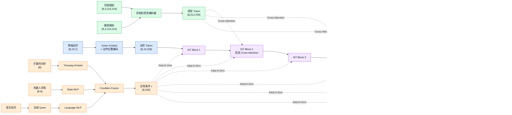
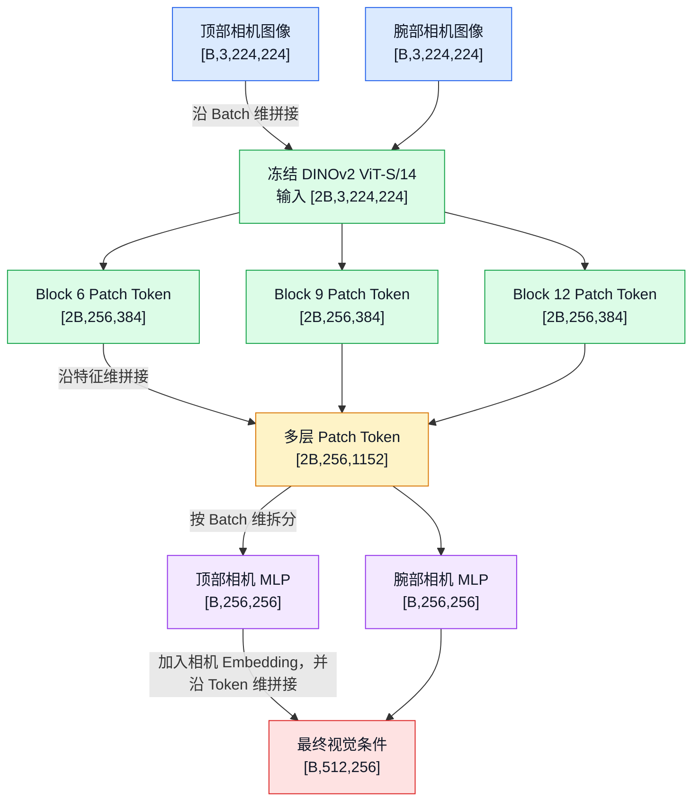
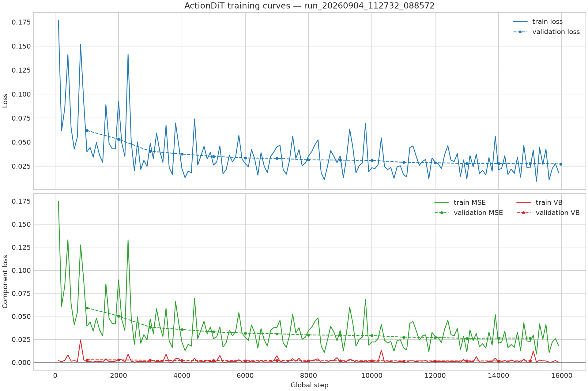
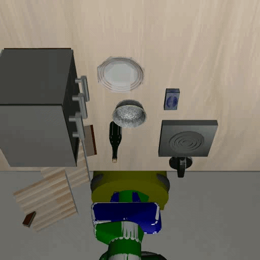
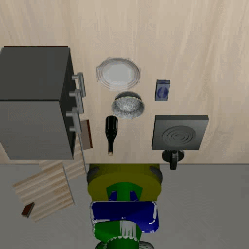

# ActionDiT 模型改进与实验分析

> 日期：2026.7~2026.9
> 项目仓库：https://github.com/sunple666/Action-DiT

## 摘要

本项目尝试在 LIBERO Goal 环境中训练一个基于 Diffusion Transformer（DiT）的机器人动作模型。模型需要根据语言指令、机器人状态和相机图像，一次预测未来 16 步动作。最初的模型在 30 次全任务评测中成功 0 次：机械臂通常知道目标的大致方向，却很难准确抓住物体或完成旋转、放置等操作。为了找出问题，我先后检查了 observation 与 action 的时间对齐，进行了专家动作回放、离线误差分析和语言敏感性测试，并修正了数据与推理流程中发现的问题。

在确认基础流程后，我将原来较简单的图像条件注入改成了视觉 patch cross-attention，并加入顶部相机和腕部相机。之后又测试了解冻 DINOv2 最后两个 block、融合 DINOv2 中间层特征等方法。结果显示，模型已经能够完成一部分任务，其中“打开燃气灶”最稳定，但精确抓取和较长的搬运任务仍然比较困难。冻结 DINO 和解冻最后两个 block 在针对性评测中都取得了 11/20；中间层标量门控和 concat+MLP 两种方案在 100 次评测中分别取得 13/100 和 12/100，没有明显提高总体成功率。

虽然本项目没有得到很高的任务成功率，但完成了从检查数据、定位问题、修改模型到设计消融实验和分析失败案例的完整过程，也为之后科研学习打下了一定基础。

---

## 1. 方法基础

### 1.1 动作扩散模型

模型预测长度为 \(H=16\) 的动作块：

$$
\mathbf{a}_{t:t+H-1} \in \mathbb{R}^{H \times 7}
$$

其中 7 维动作由三维末端平移、三维末端旋转和一维夹爪控制组成。训练时对归一化动作加入高斯噪声，模型根据扩散时间步和多模态条件预测去噪目标；推理时使用 DDIM 从随机噪声逐步生成动作块。

### 1.2 ActionDiT 主干

当前模型的主要配置如下：

| 项目              |     配置 |
| ----------------- | -------: |
| 动作维度          |        7 |
| 动作块长度        |       16 |
| 机器人状态维度    |        8 |
| DiT 隐藏维度      |      256 |
| DiT block 数量    |        6 |
| 注意力头数        |        8 |
| 图像尺寸          | 224×224 |
| DINOv2 token 维度 |      384 |
| 扩散训练步数      |     1000 |
| 是否学习方差      |       是 |

动作块被编码为动作 token，并加入可学习位置编码。扩散时间步、机器人状态和语言表示经过融合后用于 AdaLN-Zero；图像 patch token 则通过 cross-attention 注入动作主干。



*图 1 ActionDiT 整体结构。时间步、状态和语言通过 AdaLN-Zero 注入，双相机视觉 token 通过 cross-attention 注入。*

### 1.3 条件注入设计

初始结构将多种条件直接相加。该做法实现简单，但不同模态具有不同语义和形状：时间步、状态和语言更接近全局条件，图像则包含大量具有空间对应关系的 patch。为保留视觉空间结构，本项目采用：

- 时间步、状态、语言：归一化、拼接并经过 MLP，生成 AdaLN-Zero 条件；
- 图像：保留 patch token，通过 cross-attention 提供给动作 token；
- 两路相机：使用独立 adapter、camera embedding 和 cross-attention。

### 1.4 双相机视觉编码

顶部相机提供场景布局，腕部相机提供近距离接触信息。两路图像在 batch 维拼接后共同经过冻结的 DINOv2 ViT-S/14，再按相机拆分。两路视觉特征使用独立投影网络，以允许模型学习不同的视觉统计特征。

```text
顶部相机 ─ DINOv2 ─ 顶部 adapter ─ 顶部 cross-attention ─┐
                                                          ├─ ActionDiT
腕部相机 ─ DINOv2 ─ 腕部 adapter ─ 腕部 cross-attention ─┘
```



*图 2 DINOv2 中间层 concat+MLP 融合过程。*

---

## 2. 数据与推理检查

在改进模型之前，我先检查了数据和推理流程。通过离线比较当前观察与相邻动作，并用 `expert.py` 在 LIBERO 中回放专家轨迹，我发现并修正了 LIBERO 动作时序问题，随后重新训练模型。模型在验证集上的动作误差约为 0.2，但离线误差较低并不代表在线任务一定成功，因为执行中的偏差会逐步积累，抓取和接触阶段的小误差也可能直接导致失败。因此，离线误差主要用于排查问题，最终仍以在线成功率为准。语言敏感性测试还表明，替换指令会改变动作输出，但影响不够稳定，说明模型使用了语言信息，却还不能始终准确地选择目标。

---

## 3. 模型改进与消融实验

### 3.1 视觉 Patch Cross-Attention

最初模型将视觉信息压缩后与其他条件组合，容易丢失空间结构。改进后，动作 token 作为 query，DINOv2 patch token 作为 key 和 value：

\[
\mathrm{Attention}(Q_{action},K_{vision},V_{vision}).
\]

这样，每个动作 token 可以选择与当前动作阶段相关的图像区域。cross-attention 被加入第 2、4、6 个 DiT block，并使用零初始化条件门控保持训练初期稳定。

### 3.2 腕部相机与双流结构

腕部相机用于补充顶部相机难以观察的局部接触信息。初始双相机实现将两路特征直接组合，后续改为两个独立视觉 adapter 和两套 cross-attention，使两种视角能够学习不同映射。

离线消融中，正常使用腕部图像时的归一化 MAE 为 0.170；将腕部图像置零和打乱后，MAE 分别上升到 0.341 和 0.378。这说明模型确实使用了腕部信息。尽管从成功率角度看，加入腕部相机的提升并不大，但从视频回放上看，模型确实有更好的表现，交互时更加准确。

### 3.3 执行 Horizon 与噪声策略

模型一次预测 16 步动作。实验比较了不同执行 horizon，较长 horizon 在部分模型中表现更好，说明动作块内部的连续性对当前模型较重要。最终主要评测统一采用 `execute_horizon=16`。

此外，本项目比较了：

- 每次重规划重新采样噪声；
- 每个 episode 复用相同初始噪声；
- 同一观察下采样多个动作块并进行连续动作平均和夹爪投票。

多噪声 ensemble 没有稳定提高成功率，因此在现有实验中，单次 diffusion 采样方差不是最明显的问题。

### 3.4 接触阶段加权

根据接触阶段误差分析，本项目尝试提高转折与接触附近动作的 MSE 权重。该版本在 30 次在线评测中仅成功 1 次，低于未加权版本。简单增加局部动作权重无法解决闭环状态偏移，反而可能破坏整体轨迹学习。

### 3.5 解冻 DINOv2 最后两个 Block

为了使视觉编码器适应机器人操作数据，本项目解冻 DINOv2 最后两个 block 和最终 LayerNorm，并与 ActionDiT 使用相同学习率。小规模全任务评测一度获得 6/30，但扩大针对性评测后，新旧模型表现基本一致：

| 模型               | Task 1：碗放到炉灶 | Task 7：打开炉灶 |  合计 |
| ------------------ | -----------------: | ---------------: | ----: |
| 冻结 DINOv2        |               1/10 |            10/10 | 11/20 |
| 解冻最后两个 block |               2/10 |             9/10 | 11/20 |

后续针对性评测中，冻结和解冻模型都取得了 11/20。因此，小规模评测中的优势没有被稳定复现，现有结果不足以说明解冻 DINO 能提高成功率。

### 3.6 DINOv2 中间层标量门控

DINOv2 最终层偏向高层语义，而中间层可能保留更多边缘、位置和局部结构。本项目提取第 6、9、12 层 patch token，并以最终层为主分支，通过零初始化标量门控加入中间层残差。

训练后的门控参数为：

```text
agent raw: [-0.0313, -0.0351]
wrist raw: [ 0.0022,  0.0062]
```

顶部相机仅使用约 3% 的负向中间层残差，腕部相机门控接近零，说明模型基本退化为只使用最终层。该版本在 100 次评测中取得 13/100。

### 3.7 DINOv2 中间层 Concat+MLP

为避免零门控阻断中间层学习，进一步将三个层级沿通道维拼接：

```text
[B, 3, 256, 384]
        ↓ permute + reshape
[B, 256, 1152]
        ↓ camera-specific MLP
[B, 256, D]
```

该方法强制三个层级共同进入 projection，同时保持 cross-attention 的视觉 token 数不变。最终模型在 100 次评测中取得 12/100，与标量门控版本基本一致。

---

## 4. 实验设置

### 4.1 数据集与任务

实验使用 LIBERO Goal 的 10 个任务：

| Task ID | 语言指令                                    |
| ------: | ------------------------------------------- |
|       0 | open the middle drawer of the cabinet       |
|       1 | put the bowl on the stove                   |
|       2 | put the wine bottle on top of the cabinet   |
|       3 | open the top drawer and put the bowl inside |
|       4 | put the bowl on top of the cabinet          |
|       5 | push the plate to the front of the stove    |
|       6 | put the cream cheese in the bowl            |
|       7 | turn on the stove                           |
|       8 | put the bowl on the plate                   |
|       9 | put the wine bottle on the rack             |

### 4.2 训练配置

主要训练参数如下：

| 参数       |                数值 |
| ---------- | ------------------: |
| Epoch      |                  10 |
| Batch size |                  32 |
| 初始学习率 |                1e-4 |
| 最小学习率 |                1e-5 |
| 学习率调度 |    Cosine Annealing |
| 数值精度   |                BF16 |
| 动作块长度 |                  16 |
| 图像输入   | 顶部相机 + 腕部相机 |

训练损失的变化如下图所示：



### 4.3 在线评测配置

正式评测采用：

| 参数            |                   数值 |
| --------------- | ---------------------: |
| DDIM steps      |                     50 |
| Eta             |                      0 |
| Execute horizon |                     16 |
| 每次观察采样数  |                      1 |
| 最大环境步数    |                    300 |
| 正式评测规模    | 10 任务 × 10 初始状态 |

不同阶段曾使用每任务 3 次的快速评测。由于评测规模和扩散噪声序列不同，小规模成功率仅用于开发阶段筛选，不能与 100 次正式评测进行严格的数值比较。

---

## 5. 实验结果

### 5.1 实验汇总

| 实验版本               | 评测规模 | 成功数 | 主要结论                           |
| ---------------------- | -------: | -----: | ---------------------------------- |
| 早期全任务模型         |       30 |      0 | 尚无稳定在线能力                   |
| 观察动作对齐修复后模型 |       30 |      4 | 数据/推理修正后出现成功案例        |
| 双相机随机噪声         |       30 |      3 | 双相机未产生显著整体提升           |
| 双流 cross-attention   |       30 |      4 | 独立相机流合理，但提升有限         |
| Transition-aware loss  |       30 |      1 | 动作加权导致退化                   |
| DINOv2 解冻两层        |       30 |      6 | 小样本结果偏高，扩大评测后优势消失 |
| 中间层标量门控         |      100 |     13 | 门控接近零，模型几乎忽略中间层     |
| 中间层 concat+MLP      |      100 |     12 | 改变任务偏好，但总体无提升         |

> 注：不同评测规模的成功率不应进行严格显著性比较。相同规模和条件下的对照结果优先用于结论。

### 5.2 最终两种中间层模型的分任务结果

|           Task |         标量门控 |       Concat+MLP |
| -------------: | ---------------: | ---------------: |
|              0 |             3/10 |             0/10 |
|              1 |             1/10 |             1/10 |
|              2 |             0/10 |             0/10 |
|              3 |             0/10 |             0/10 |
|              4 |             0/10 |             0/10 |
|              5 |             0/10 |             0/10 |
|              6 |             1/10 |             1/10 |
|              7 |             8/10 |             8/10 |
|              8 |             0/10 |             2/10 |
|              9 |             0/10 |             0/10 |
| **总计** | **13/100** | **12/100** |

concat+MLP 失去了标量门控模型在 task 0 上的 3 次成功，同时在 task 8 上新增 2 次成功；task 1、6、7 完全一致。这说明静态多层融合改变了模型对任务的偏好，但没有提高总体能力。

### 5.3 典型成功任务

Task 7“打开燃气灶”是当前最稳定的任务，两种中间层模型均达到 8/10，这是模型学习得最好的任务。

Task 1、6、8 出现少量成功，说明模型具有一定的抓取和搬运能力，但稳定性不足。

下面展示 task 1 和 task 7 的成功执行过程：

| Task 1：将碗放到炉灶上 | Task 7：打开燃气灶 |
| :---------------------: | :----------------: |
| [](https://github.com/sunple666/Action-DiT/blob/wrist-camera/report_videos/task1.gif) | [](https://github.com/sunple666/Action-DiT/blob/wrist-camera/report_videos/task7.gif) |
| [点击观看 Task 1 完整动画](https://github.com/sunple666/Action-DiT/blob/wrist-camera/report_videos/task1.gif) | [点击观看 Task 7 完整动画](https://github.com/sunple666/Action-DiT/blob/wrist-camera/report_videos/task7.gif) |

### 5.4 典型失败模式

根据 rollout 观察，主要的失败原因为：

1. **目标区域错误：** 语言指定中间抽屉，但机械臂前往其他抽屉；
2. **粗定位成功、精定位失败：** 能靠近物体，但末端位置偏离抓取点；
3. **长时误差累积：** 多阶段任务在前序动作偏移后无法恢复。

---

## 6. 讨论

### 6.1 主要发现

数据对齐检查和专家回放排除了基础流程中的主要错误，语言敏感性实验也说明模型确实会受到语言指令影响。采用 patch cross-attention 和双相机结构的模型能够完成少数任务，但现有消融结果不足以证明这两项修改明显提高了总体成功率。

解冻 DINOv2、中间层融合、多噪声集成和接触阶段加权都没有带来稳定提升。这说明当前问题不能仅靠增加视觉特征或调整损失权重解决。

### 6.2 中间层融合与主要瓶颈

标量门控模型的门控值接近零，说明模型基本没有使用中间层。concat+MLP 强制融合中间层后，总成功率仍由 13/100 变为 12/100，只改变了部分任务的成功分布。不同任务可能需要不同层级的视觉信息，固定融合难以同时适应所有任务。

从失败视频看，模型通常能够接近目标，但容易在抓取点、接触方向和夹爪时机上出错。当前更主要的瓶颈可能是视觉定位精度、单帧观察缺少动作阶段信息，以及动作块执行后的闭环误差积累。

---

## 7. 结论

本项目完成了 ActionDiT 的数据处理、训练、推理和 LIBERO 在线评测流程，并编写了动作对齐、专家回放、语言敏感性和接触阶段误差等检查工具。

实验中，模型能够稳定完成打开燃气灶等少数任务，但在精确抓取、搬运和长序列操作上仍然表现较差。解冻 DINOv2 和两种中间层融合方案均未明显提高总体成功率，因此继续简单增加 DINO 层级的意义有限。相比最终分数，本项目更重要的收获是掌握了问题诊断、对照实验和结果分析的基本方法。
